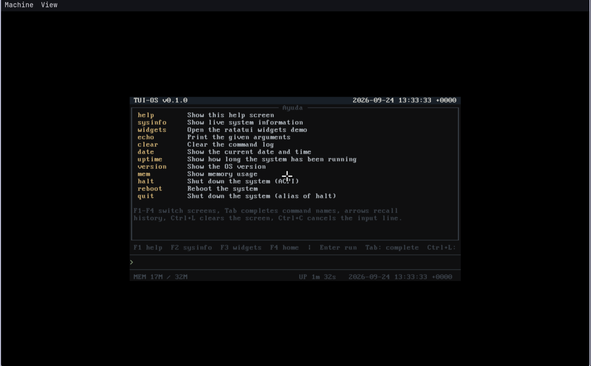
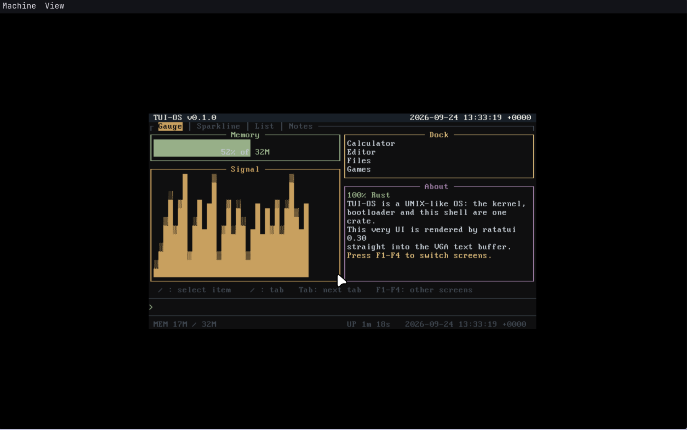

# TUI-OS

**Un sistema operativo completo escrito 100 % en Rust, con un escritorio de
texto (TUI) dibujado directamente sobre el buffer VGA 80×25.**

```
 _____ _   _ ___       ___  ____
|_   _| | | |_ _|     / _ \/ ___|   TUI-OS v0.1.0  ░  a 100% Rust OS
  | | | | | || |_____| | | \___ \   ratatui 0.30 -> VGA text 80x25
  | | | |_| || |_____| |_| |___) |   amd64 · kernel + bootloader + desktop
  |_|  \___/|___|     \___/|____/
```

## Capturas

### Terminal integrado

El shell que vive dentro del kernel: `ls`, `cd`, `mkdir`, `mem`, `uptime`,
`date`… con la sintaxis habitual de Unix.



### Monitor del sistema

La aplicación Sistema muestra la CPU y la memoria en vivo, con medidor de
RAM y gráfico de actividad.



## ¿Qué es TUI-OS?

TUI-OS es un sistema operativo autocontenido construido a partir de un
recorte de [MOROS] v0.13.0 (solo kernel + bootloader), en el que **todo vive
dentro del kernel**: no hay espacio de usuario.

Al arrancar levanta el teclado PS/2, el reloj RTC, un puerto serie y un
**escritorio TUI** que dibuja ventanas de ratatui 0.30 directamente en el
buffer de texto VGA 80×25 (`0xB8000`) por medio de un `VgaBackend` propio.

### Características

- **100 % Rust** — kernel, bootloader y escritorio en un solo crate.
- **Sin userspace** — todo el sistema corre en el kernel.
- **Escritorio con dock** — lanza aplicaciones a pantalla completa.
- **Interfaz en español** — la UI del sistema está íntegramente en español.
- **Arranca en hardware real** — x86-64 con BIOS/CSM (2005–2020).

## El escritorio

Al encender aterrizas en el **escritorio**: un dock en la parte inferior te
permite lanzar las aplicaciones a pantalla completa (`Enter` abre, `Esc`
vuelve al escritorio):

| App      | Qué hace |
| -------- | --- |
| **Archivos** | Administrador de archivos de tres paneles (padre / actual / info + vista previa) con crear, renombrar, borrar, copiar y mover. |
| **Terminal** | Un shell dentro del kernel con un conjunto funcional de comandos (`ls`, `cd`, `cat`, `mkdir`, `rm`, `mv`, `cp`, `mem`, `uptime`, `date`, `abrir`, …). |
| **Sistema** | Información de CPU/RAM en vivo con medidor de memoria y gráfico de actividad. |
| **Ayuda** | Lista de comandos, atajos de teclado y aplicaciones del dock. |
| **Apagar** | Apagado por ACPI (también `halt` / `reboot` desde el terminal). |

Los nombres de los comandos siguen las convenciones habituales de Unix. En el
primer arranque el sistema formatea el disco ATA y siembra unos archivos de
bienvenida, así que el administrador de archivos y `ls` tienen contenido
nada más encender.

## Requisitos

Necesitas `git`, `gcc`, `make`, `curl`, `qemu-img`, `qemu-system-x86_64`,
`python3` y un toolchain reciente de Rust **nightly** (ver
`rust-toolchain.toml`) con el subcomando `bootimage` de cargo:

    $ curl https://sh.rustup.rs -sSf | sh -s -- -y --default-toolchain none
    $ rustup show
    $ cargo install bootimage

## Compilar y ejecutar en QEMU

Todos los comandos siguientes se ejecutan desde la carpeta `os-tui/`, donde
vive el proyecto.

Construye la imagen de disco arrancable:

    $ make image        # -> target/x86_64-tuios/release/bootimage-tuios.bin

Ejecútala en QEMU con ventana (añade `monitor=true` para consola telnet):

    $ make qemu

O en modo headless, con un monitor por socket unix:

    $ qemu-system-x86_64 \
        -name "TUI-OS" -m 32 -smp 2 -cpu core2duo \
        -drive file=target/x86_64-tuios/release/bootimage-tuios.bin,format=raw \
        -monitor unix:/tmp/tuios-mon.sock,server,nowait \
        -display none -serial file:/tmp/tuios-serial.log

Con `-display none` no hay GUI: se maneja el teclado a través del monitor de
QEMU. **`sendkey` acepta una sola tecla por comando** — mándalas de una en
una en vez de una lista separada por comas o espacios:

    (monitor) sendkey a
    (monitor) sendkey r
    (monitor) sendkey c
    (monitor) sendkey h
    (monitor) sendkey i
    ...
    (monitor) sendkey ret

Nombres de tecla: `ret`, `tab`, `spc`, `backspace`, `f1`–`f12`,
`up`/`down`/`left`/`right`. El kernel vacía todo el buffer de salida del
8042 dentro de una sola IRQ1 (máx. 32 bytes, esperando entre lecturas), lo
que mantiene funcionando las ráfagas rápidas de teclado tanto en QEMU como
en hardware real.

## Ejecutar en hardware real

Arranca en máquinas x86-64 de ~2005–2020 con **BIOS/CSM** habilitado (UEFI
no está soportado). Escribe la imagen en un USB y arranca desde él:

    $ sudo dd if=target/x86_64-tuios/release/bootimage-tuios.bin of=/dev/sdX bs=4M conv=fsync

`sdX` es tu dispositivo USB — **comprueba bien el nombre, ¡`dd` lo va a
sobrescribir!**. En la máquina, activa el arranque Legacy/CSM y selecciona el
USB. El teclado es PS/2 (disposición `qwerty` por defecto; se puede cambiar
en la compilación con `make image keyboard=azerty`).

## Desarrollo

    $ make test        # compila + arranca la imagen en QEMU y ejecuta las pruebas del kernel

## Licencia

MIT, igual que el MOROS original. TUI-OS deriva de [vinc/moros] v0.13.0
(kernel + bootloader); el copyright y la licencia originales de MOROS se
conservan en `LICENSE` y `CHANGELOG.md`.

## Documentación técnica

El README técnico del proyecto (en inglés) está en `os-tui/README.md`, junto
con `CONTRIBUTING.md`, `CHANGELOG.md` y `LICENSE`.

[MOROS]: https://github.com/vinc/moros
[vinc/moros]: https://github.com/vinc/moros